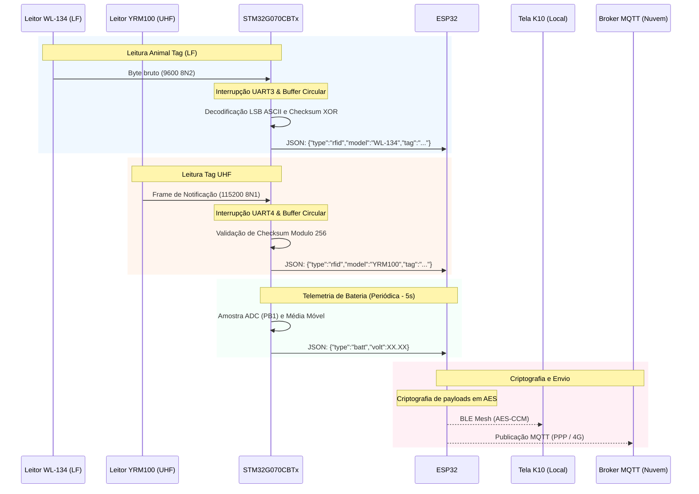

# Manual de Arquitetura do Sistema Bastão-ESP

Este documento descreve as especificações físicas de hardware, a pinagem dos microcontroladores, as interfaces de comunicação e a arquitetura geral de fluxo de dados.

> [!NOTE]
> O esquema elétrico completo do circuito da placa está documentado e disponível no arquivo [esquematico_placa.pdf](file:///d:/git/Bastao/Bastão-ESP/Manual/esquematico_placa.pdf).

---

## 1. Visão Geral do Sistema

O sistema é baseado em dois microcontroladores cooperativos, onde cada um assume um papel especializado:
* **STM32G070CBTx**: Hub de sensoriamento de baixo nível. Lida com leitura física de RFID (LF e UHF), controle de energia de sensores e telemetria local de bateria.
* **ESP32**: Hub de conectividade local e remota. Lida com criptografia, rede BLE Mesh local e comunicação celular/GPS em nuvem.

---

## 2. Pinagem e Interfaces de Hardware

### 2.1. STM32G070CBTx
A tabela abaixo lista os pinos e conexões configuradas na placa de sensoriamento:

| Pinos | Periférico | Função | Parâmetros |
| :--- | :--- | :--- | :--- |
| **PA5 (TX) / PB0 (RX)** | USART3 | Interface com Leitor WL-134 (LF 134.2KHz) | 9600 bps, **8N2**, nível TTL |
| **PA9 (TX) / PA10 (RX)** | USART1 | Não Utilizada / Reservada | - |
| **PA2 (TX) / PA3 (RX)** | USART2 | Interface de comunicação com o ESP32 | 115200 bps, **8N1**, nível TTL |
| **PA0 (TX) / PA1 (RX)** | USART4 | Interface com Leitor YRM100 (UHF) | 115200 bps, **8N1**, nível TTL |
| **PB1 (IN9)** | ADC1 | Leitura analógica da tensão da bateria | Divisor resistivo: R1 = 100kΩ, R2 = 10kΩ |
| **PB4** | GPIO Output | Controle de energia do leitor WL-134 | Nível ALTO: Ativo, Nível BAIXO: Desligado |
| **PB5** | GPIO Output | Controle de energia do leitor YRM100 | Nível ALTO: Ativo, Nível BAIXO: Desligado |

### 2.2. ESP32
Responsável pelo tráfego de rede e segurança de dados:
* **UART (Pinos 17 e 18)**: Interface serial para comunicação com o modem celular **SIMCom 7663E**.
* **UART (IO13-RX / IO14-TX)**: Interface de recepção serial ligada ao STM32 (PA2-TX / PA3-RX). Conforme as páginas 2 e 11 do [esquematico_placa.pdf](file:///d:/git/Bastao/Bastão-ESP/Manual/esquematico_placa.pdf).
* **BLE Mesh (Interno)**: Comunicação sem foi local atuando como Provisionador/Coordenador com a Tela K10.
* **Bluetooth (Interno)**: Comunicação segura ponto a ponto com aplicativo de celular (GATT Server) para tráfego de dados de configuração e de negócio (Fazenda, Lote e Animal).
* **Wi-Fi (Interno)**: Conexão local em bases carregadoras/currais para transmissão de dados de alta velocidade e atualizações remotas de firmware (OTA).

---

## 3. Fluxo de Dados e Integração (Pipeline)

O pipeline de dados opera ciclicamente no tratamento das leituras de RFID e telemetria:

---

## 4. Estrutura do Firmware do Projeto

O código do projeto está dividido em dois blocos lógicos:

### 4.1. stm32_firmware
* **Drivers HAL**: Controlam as portas de comunicação USART e conversores ADC.
* **Handlers de Interrupção**: Salvam de forma não bloqueante os caracteres recebidos dos leitores em buffers circulares dedicados.
* **Processadores de Protocolo**: Varrem os buffers no loop principal (`while(1)`), garantem o parsing de pacotes válidos e despacham dados ao ESP32.

### 4.2. esp32_firmware
* **Framework**: ESP-IDF v5.x integrado com FreeRTOS.
* **Tasks do Sistema**:
  1. *Task UART Receiver*: Recebe as strings de dados formatadas em JSON vindas do STM32.
  2. *Task Cryptography*: Codifica as mensagens usando algoritmo AES antes do envio.
  3. *Task BLE Mesh*: Gerencia a whitelist de UUIDs e envia as informações de tags para a tela.
  4. *Task SIMCom MQTT*: Inicializa a interface PPP e realiza as publicações MQTT com segurança SSL/TLS.
  5. *Task Bluetooth Mobile*: Inicializa o GATT Server para sincronização segura com celular de dados de configuração e de negócio.
  6. *Task OTA Manager*: Gerencia o download seguro HTTPS e gravação do firmware na partição de boot inativa, selecionando entre Wi-Fi ou 4G dependendo da disponibilidade.
  7. *Task Offline Storage (Spooler)*: Gerencia a gravação de registros na partição flash local (LittleFS/SPIFFS) quando offline, e o envio/descarte sequencial (FIFO) para a nuvem quando a conexão é restabelecida.

---

## 5. Diretrizes de Arquitetura de Software e Documentação

Para suportar o crescimento escalável do projeto e simplificar a manutenção concorrente por desenvolvedores e agentes autônomos, são adotadas as seguintes regras arquiteturais:

### 5.1. Modularização Obrigatória ("Dividir para Conquistar")
* **Isolamento de Componentes:** É proibido implementar lógica operacional complexa (como parseamento de protocolos, filtros digitais e inicializações de periféricos) diretamente nos arquivos principais (`main.c`).
* **Estrutura de Bibliotecas:** Cada subsistema (ex: leitura analógica, comunicação serial com sensores, modem de telefonia) deve possuir um cabeçalho `.h` especificando a interface pública e um arquivo `.c` encapsulando as variáveis estáticas e lógica de execução.
* **Orquestradores Limpos:** Os arquivos `main.c` (no STM32 e no ESP32) devem conter exclusivamente o fluxo de inicialização geral, criação de instâncias de sincronização (filas, mutexes, semáforos) e chamadas às funções de interface pública dos módulos.

### 5.2. Padrão Rígido de Documentação de Funções (Doxygen)
Todas as funções públicas e privadas do sistema devem ser documentadas utilizando blocos de comentários no formato Doxygen. O bloco deve descrever explicitamente:
1. **`@brief`**: Descrição resumida e concisa da finalidade da função.
2. **`@details`** *(Opcional)*: Detalhamento do algoritmo de execução ou restrições internas.
3. **`@param[in, out]`**: Direção dos parâmetros (`[in]` para leitura, `[out]` para gravação por ponteiro, ou `[in,out]` para modificação), nome e explicação física.
4. **`@return`**: Significado lógico dos retornos (com destaque para tratamento de falhas e erros de baixo nível).
5. **`@pre` / `@post`**: Precondições necessárias do sistema (ex: driver iniciado) e estados resultantes após a conclusão.
6. **`@note` / `@warning`**: Notas de uso ou efeitos colaterais críticos (ex: alocação dinâmica de heap, condições de corrida ou dependência de interrupções de hardware).

