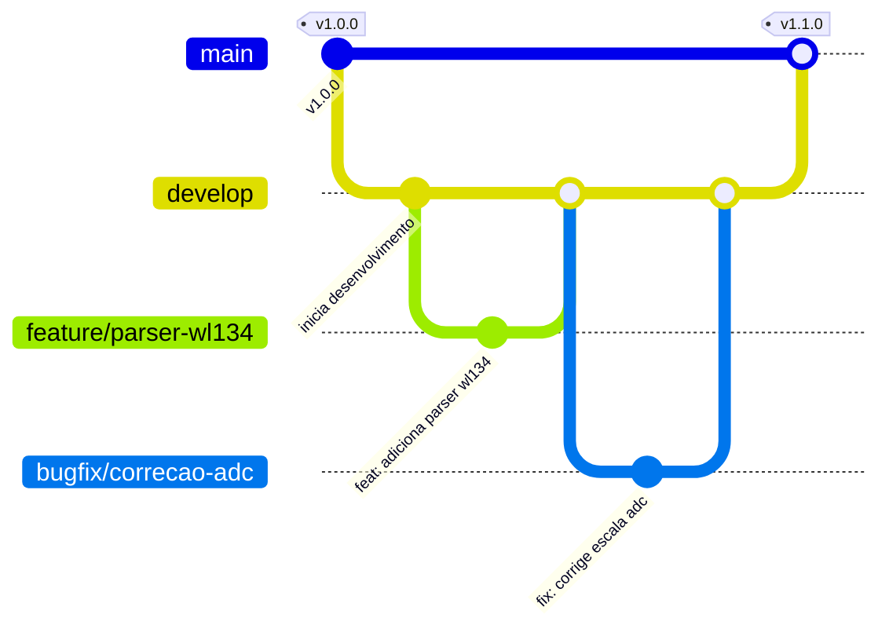

# Diretrizes de Versionamento Git e Controle de Código

Este documento define o padrão de versionamento, fluxo de branches e formato de commits a ser seguido por todos os desenvolvedores (humanos e agentes de IA) no projeto Bastão-ESP.

---

## 1. Modelo de Branches (Git Flow Simplificado)

Para manter o histórico do repositório limpo e o código em produção estável, adotamos o seguinte modelo de gerenciamento de branches:



### 1.1. Descrição dos Branches
* **`main`**:
  * Ponto de entrada de código testado e estável.
  * Nunca faça commits diretamente na `main`. Todo código entra via merge ou Pull Request vindo de `develop`.
  * Cada merge na `main` deve receber uma Tag de versão correspondente.
* **`develop`**:
  * Ramo principal de desenvolvimento. Integra as novas funcionalidades prontas para teste.
  * Desenvolvedores integram suas alterações aqui após validação inicial.
* **`feature/<nome-da-feature>`**:
  * Criado a partir de `develop`.
  * Destinado ao desenvolvimento isolado de um novo driver, funcionalidade ou tela.
  * Exemplo: `feature/leitura-yrm100`.
* **`bugfix/<nome-do-bug>`**:
  * Criado a partir de `develop`.
  * Destinado a correções de bugs em tempo de desenvolvimento.
* **`hotfix/<nome-do-ajuste>`**:
  * Criado a partir de `main` quando um bug crítico for detectado em produção.
  * Após a correção, deve ser mesclado na `main` (com nova tag de patch) e de volta para a `develop`.

---

## 2. Padrão de Mensagens de Commit

Utilizamos o padrão de **Conventional Commits** adaptado para simplificar a leitura do histórico do projeto. O formato é:

```text
<tipo>: <descrição sucinta em português>
```

### 2.1. Tipos Permitidos
* **`feat`**: Implementação de nova funcionalidade ou driver (ex: `feat: adiciona controle de energia do WL-134`).
* **`fix`**: Correção de bug no código de produção (ex: `fix: corrige offset na conversão do ADC`).
* **`docs`**: Atualização ou criação de documentação (ex: `docs: adiciona manual de pinagem do stm32`).
* **`refactor`**: Reestruturação de código que não altera o comportamento final do sistema (ex: `refactor: modulariza drivers de UART`).
* **`test`**: Criação ou manutenção de testes automatizados (ex: `test: adiciona mock de pacotes UHF`).
* **`style`**: Formatação ou estilo de código (espaços, identação, remoção de comentários desnecessários).

---

## 3. Versionamento Semântico (SemVer 2.0.0)

O controle de versão do sistema Bastão segue a especificação `vMajor.Minor.Patch` (ex: `v2.1.0`):

1. **Major (Maior)**: Modificações estruturais que rompem compatibilidade ou alteram o hardware fundamental.
   * *Exemplos:* Substituição do microcontrolador STM32G070 por outra família, alteração física irreversível da pinagem de comunicação principal.
2. **Minor (Menor)**: Adição de novas funções ou suporte a novos periféricos de forma compatível.
   * *Exemplos:* Adição de suporte a um novo sensor de temperatura via I2C, inclusão de nova rota MQTT na telemetria.
3. **Patch (Correção)**: Correção de bugs retrocompatíveis.
   * *Exemplos:* Correção do overflow em uma fila do FreeRTOS, ajuste no cálculo do divisor de tensão.
