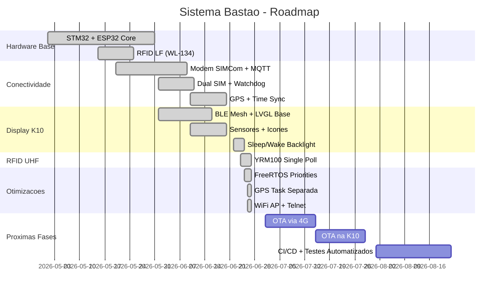

# Roadmap do Projeto

> Atualizado em: 2026-06-26

## Estado Atual

### STM32 (Sensing Hub) — Concluido
- [x] Leitura WL-134 (LF RFID) via UART3 a 9600 8N2
- [x] Leitura YRM100 (UHF RFID) via UART4 a 115200 8N1
- [x] Single poll a cada 100ms (configuracao: US 902-928MHz, 20dBm)
- [x] Inicializacao: SetMode -> SetRegion -> SetTXPower -> SaveConfig
- [x] Leitura de configuracao e report via JSON para ESP32
- [x] ADC bateria com media movel de 10 amostras
- [x] Mapeamento bateria: 8.80V=100%, 7.50V=0%
- [x] Comunicacao bidirecional com ESP32 via UART2 (115200)
- [x] Buzzer e alertas de bateria
- [x] Modo sleep removido (operacao continua)

### ESP32 Coordinator (Connectivity Hub) — Concluido
- [x] Inicializacao e watchdog do modem SIMCom 7663E
- [x] MQTT nativo via comandos AT (sem PPP)
- [x] Dual SIM com troca inteligente por sinal (< -100dBm por 5 ciclos)
- [x] GPS multi-constelacao em task separada (prio 3, Core 1)
- [x] Polling GPS adaptativo: 2s sem fix, 30s com fix
- [x] Timezone: GMT-4 (AMT+4)
- [x] BLE Mesh Coordinator (CID 0x02A5, 12 segmentos)
- [x] BLE GATT Server para app mobile
- [x] Cache offline (SPIFFS) com sync automatico
- [x] AES-256-CBC para payloads MQTT
- [x] Deduplicacao RFID (janela de 60s)
- [x] WiFi AP ``Bastao-XXXXXX`` (WPA2, debug Telnet)
- [x] Logger Telnet na porta 23
- [x] OTA via Wi-Fi (particoes A/B)
- [x] Prioridades FreeRTOS otimizadas
- [x] Tasks com stacks ajustadas e monitoring

### K10 Display — Concluido
- [x] LVGL com icones condicionais (RFID, 4G, WiFi, GPS, bateria)
- [x] Backlight timeout: 2 minutos (120s)
- [x] Wake por botao ou recebimento de tag via Mesh
- [x] Exibicao de coordenadas GPS em tempo real
- [x] Status de conectividade celular (RSSI + operadora)
- [x] BLE Mesh Node com persistencia NVS
- [x] Polling de 50ms para dados Mesh
- [x] Acelerometro e bateria locais

## Cronograma (Mermaid Gantt)

## Recursos Concluidos (Ultimas Sessoes)

| Sessao | Data | Descricao |
|--------|:----:|-----------|
| 40 | 26-jun | YRM100: configuracao de regiao + potencia + init sequence |
| 41 | 26-jun | GPS adaptativo: polling 2s (busca) / 30s (fix) |
| 42 | 26-jun | Otimizacao FreeRTOS: prioridades, stacks, monitoring |
| 43 | 26-jun | GPS em task separada (gps_reader_task prio 3 Core 1) |
| 44 | 26-jun | Correcoes: nomes task, CMQTTREL retry, WiFi AP config, BLE Mesh segments |

## Proximos Passos

### Curto Prazo
- [ ] Testes de campo com leitura simultanea de tags LF + UHF
- [ ] Validacao de persistencia BLE Mesh apos power cycle
- [ ] Monitoramento de stacks FreeRTOS (verificar <500 bytes livres)

### Medio Prazo
- [ ] **OTA via 4G:** Implementar download de firmware via modem (AT+HTTPGET)
- [ ] **OTA na K10:** Adicionar particao A/B no firmware do display
- [ ] **CI/CD:** Pipeline automatizado com build + testes + deploy OTA

### Longo Prazo
- [ ] App mobile com configuracoes avançadas
- [ ] Integracao com sistemas de gestao pecuaria (SISBOV)
- [ ] Dashboard web com mapas e historico
- [ ] Machine learning para deteccao de anomalias em leituras RFID
